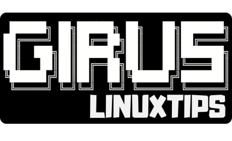

# GIRUS: Plataforma de Laboratórios Interativos

Versão 0.1.0 Codename: "Maracatu" - Março de 2025

## Visão Geral

GIRUS é uma plataforma open-source de laboratórios interativos que permite a criação, gerenciamento e execução de ambientes de aprendizado prático para tecnologias como Linux, Docker, Kubernetes, Terraform e outras ferramentas essenciais para profissionais de DevOps, SRE, Dev e Platform Engineering.

Desenvolvida pela LINUXtips, a plataforma GIRUS se diferencia por ser executada localmente na máquina do usuário, eliminando a necessidade de infraestrutura na nuvem ou configurações complexas. Através de um CLI intuitivo, os usuários podem criar rapidamente ambientes isolados e seguros onde podem praticar e aperfeiçoar suas habilidades técnicas.

##laboratorio baquesolto

# BaqueSolto
# 🐚 Curso de Lógica de Programação com Shell Script

**Aprenda programação de um jeito divertido, como se fosse um jogo!**  
Desenvolvido para iniciantes (até crianças de 10 anos!) usando exemplos do mundo real.

## 🎯 Objetivo
Ensinar os fundamentos da programação através de:
- **Brincadeiras** (jogos, calculadora, fazendinha)
- **Desafios práticos** (super-heróis, lanchonete)
- **Analogias simples** (variáveis = caixas mágicas, loops = foguetes)

## 📚 Conteúdo
A ALTERAR

## Contribuido por: Rarikmilkrai Souza
